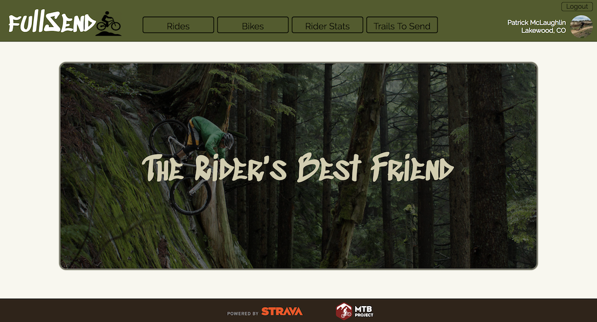
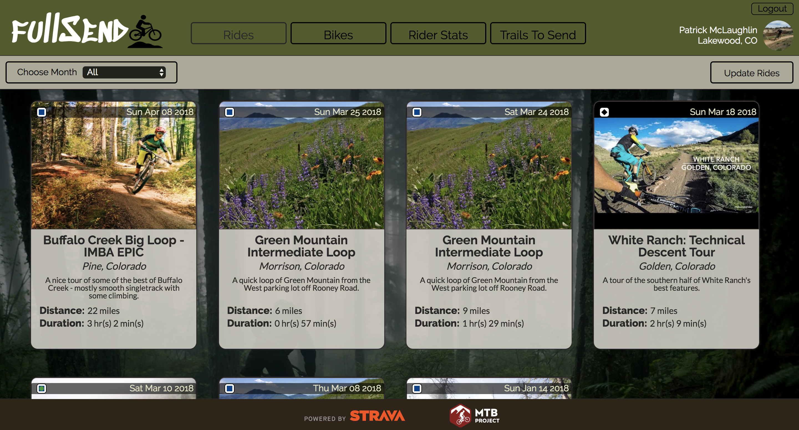
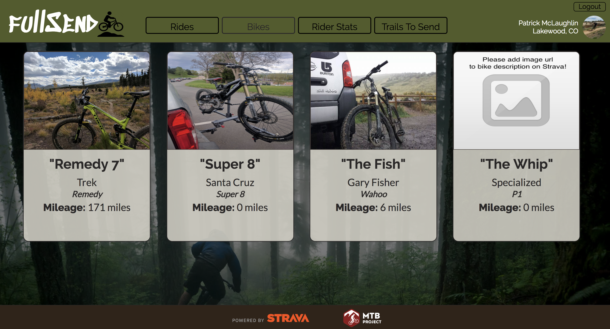
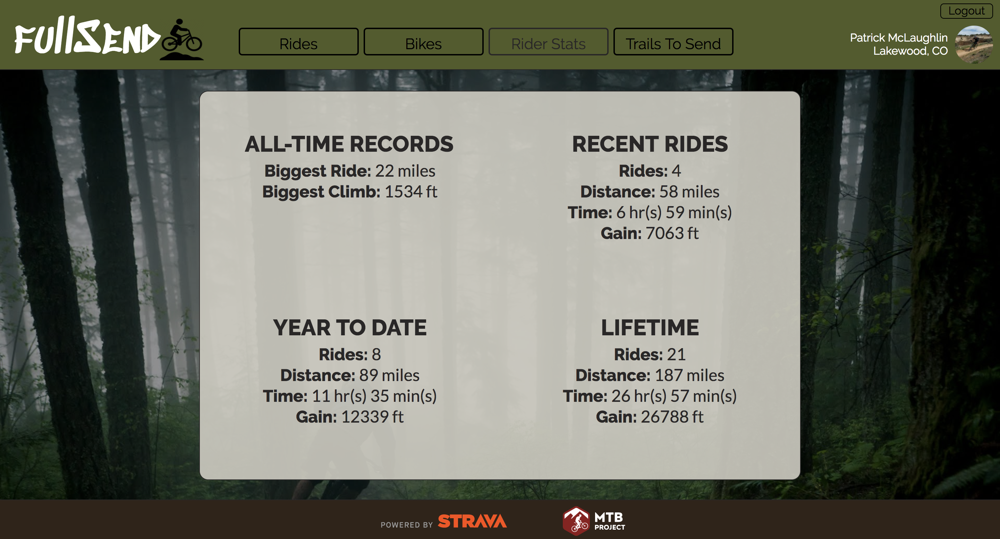
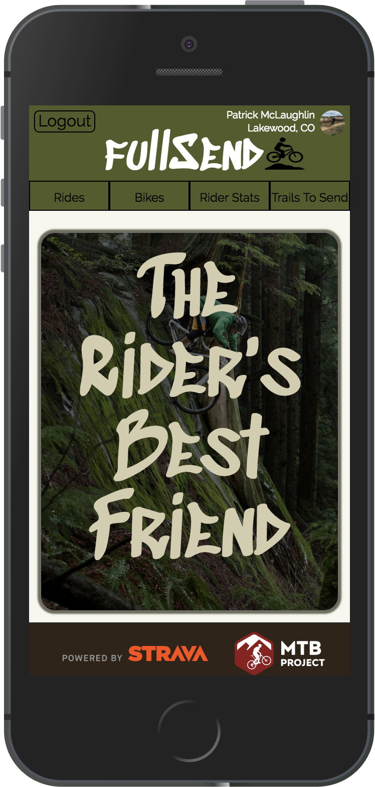
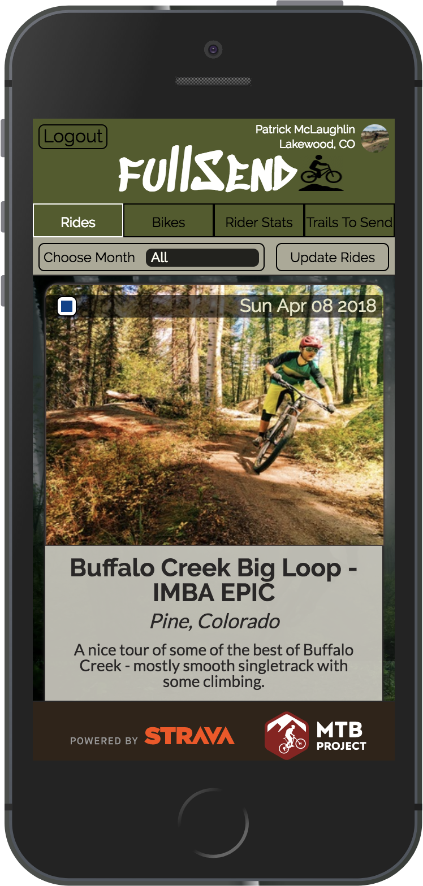
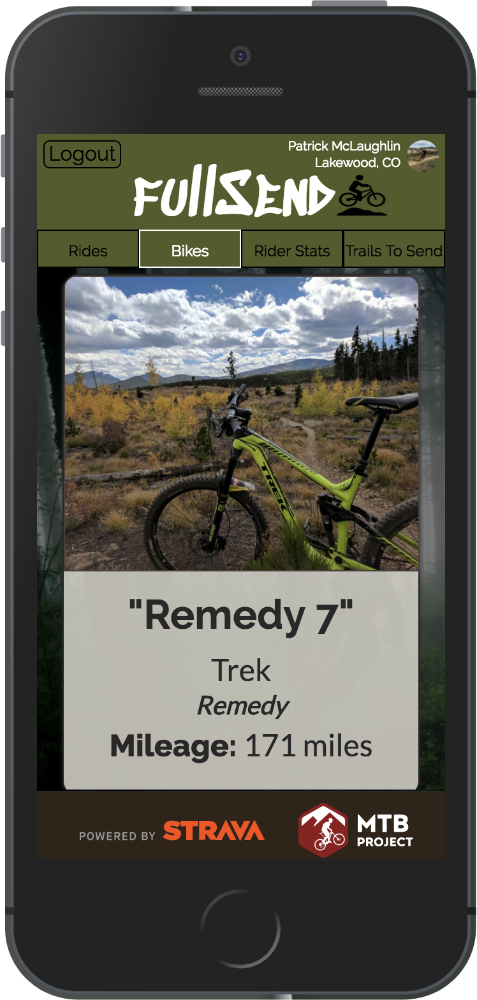
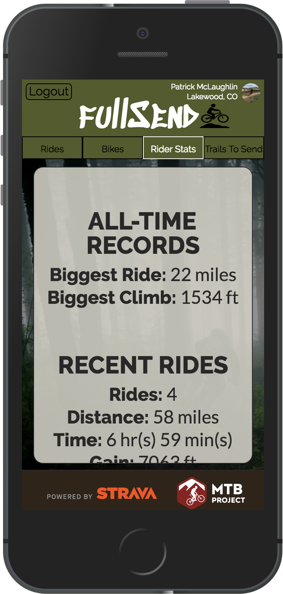
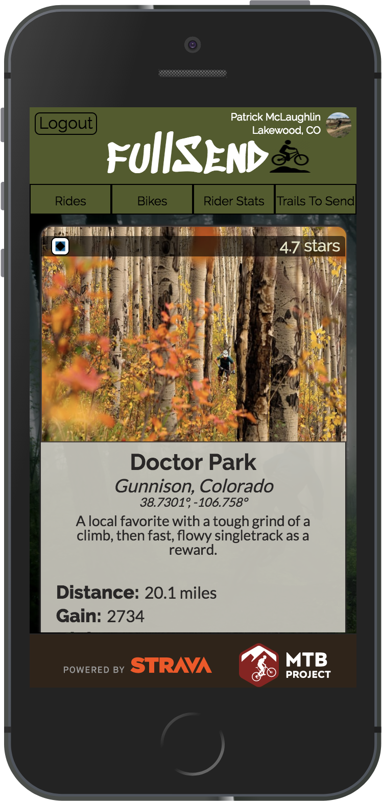

# fullSend

An application used to track a user's mountain bike rides, their stats, their bikes, and their trail to-do list. App is built on the front end using React, Redux, Router, and CSS. API information is pulled from Strava and MTB project. Backend is build using Express and Knex.

## Team

+[Pat McLaughlin](https://github.com/patrickmc21)

## Project Status

This project is currently through the MVP requirements, as well as a few additional features allowing a user to track the mileage on each of their bikes, their all-time records, recent, year-to-date, and all-time stats, as well as any trails they have on their MTB project todo list. User is able to login in through Strava OAuth, which links to the backend express server account. They are able to access previous rides from the knex database. Users can update their rides from Strava if their are additional rides to add. I would like to add functionality to users can add custom ride details to each ride such as weather conditions, riding partners, or trail traffic levels. 

## Project Screen Shots

#### Desktop

#### Mobile

## Installation and Setup Instructions

Clone down this repository. You will need `node` and `npm` installed globally on your machine.  

Installation:

`npm install`  

To Run Test Suite:  

`npm test`  

To Start Server:

`npm start`  

To Visit App:

`localhost:3001`

You will need a client token and client id from [Strava](http://developers.strava.com/) stored in `src/api/apiKeys` in a file named `strava-keys.js`. They need to be set to a `export const cliendId` and `export const clientSecret`, as well as a key from [MTB Project](https://www.mtbproject.com/data) stored in `src/api/apiKeys` in a file named `mtb-project-key.js`. Key needs to be set to a `const mtbProjectKey` and exported using `export default mtbProjectKey`.
 
To install server:

You will need `node` and `Homebrew`

clone down [this repo](https://github.com/patrickmc21/fullSend-server)

`npm install`

`brew install postgres`

`npm install -g knex`

`npm install knex --save`

`npm install pg --save`

`npm run build`

`npm start`

## Reflection

This was a two week individual project during Module Three of the front end program at Turing. Project goals included creating a personal project using React, Redux, Router, and an external API in which a user is able to fulfill a need. Additionally, we were to use jest/enzyme to build a thorough testing suite to help guide us during app development. 

I set out to build an app that would allow a user to keep track of their mountain bike rides. My inspiration comes from what I have done in the past to accomplish the same goal, which was achieved by just writing a note in my calendar. However, I almost never included where I rode, or any of the ride statistics from the day. With fullSend, a user is able to keep track of the date of their ride, what trail system they rode on, the difficulty of the trail, the location of the trail, as well as ride mileage and duration. They can also keep track of how much mileage they put on each of their bikes, their personal statistics for recent, year-to-date, and all-time rides. Lastly, they are able to view a todo list of trails they would like to ride in the future.

One of the main challenges was implementing the backend. The Strava API requires OAuth 2.0 in order to pull user information, so to accomplish this I implemented a hand-rolled express server with Strava OAuth. Additionally, I wanted users to be able to store their rides on the local server, so I added a Knex.js database to the express server to keep track of a user's rides.

Technologies used to to implement this project were the Strava API, MTB Project API, React, React-Router, React-Redux, Express, KnexJS,  JSX, vanillaJS, and CSS, as well as Jest/Enzyme for the testing suite. The boilerplate repo used to build this app was constructed using `create-react-app`.